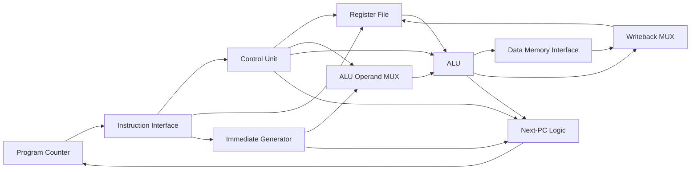

# TinyRV32

### A Compact RISC-V Core from RTL to GDSII

TinyRV32 is a compact 32-bit RISC-V-compatible processor core designed in
SystemVerilog and implemented through a complete RTL-to-GDSII flow using
OpenROAD and the SKY130 HD standard-cell library.

The project explores the complete digital IC design process:

**RTL architecture → functional verification → synthesis → floorplanning → placement → clock-tree synthesis → routing → static timing analysis → GDSII**

---

## Architecture

TinyRV32 is currently implemented as a single-cycle processor supporting a
subset of the RV32I instruction set.



### Implemented instructions

**Arithmetic**
- ADD
- SUB
- ADDI

**Logic**
- AND
- OR
- XOR

**Shifts and comparison**
- SLL
- SRL
- SLT

**Memory**
- LW
- SW

**Control flow**
- BEQ
- BNE
- JAL

---

## RTL Structure

```text
rtl/
├── alu.sv
├── control_unit.sv
├── cpu_core.sv
├── imm_gen.sv
├── next_pc.sv
├── pc.sv
└── regfile.sv
```

The core contains:

- 32-bit ALU
- 32 × 32-bit register file
- immediate generator
- instruction decoder / control unit
- program counter
- branch and next-PC logic
- load/store interface
- writeback datapath

---

## Functional Verification

Each RTL block was verified independently before full CPU integration.

Verification was performed with Icarus Verilog and GTKWave.

The integrated processor executes the following test program:

```asm
addi x1, x0, 5
addi x2, x0, 7
add  x3, x1, x2

sw   x3, 0(x0)
lw   x4, 0(x0)

beq  x3, x4, +8

addi x5, x0, 99
addi x5, x0, 42

jal  x0, 0
```

Expected final state:

```text
x1 = 5
x2 = 7
x3 = 12
memory[0] = 12
x4 = 12
x5 = 42
```

The taken `BEQ` changes the program counter from `0x14` to `0x1C`,
correctly skipping the instruction that would write `99` to `x5`.

### CPU simulation waveform


---

## RTL-to-GDSII Flow

Physical implementation was performed using:

- **Yosys** — logic synthesis
- **OpenROAD Flow Scripts**
- **SKY130**
- **sky130_fd_sc_hd** standard-cell library

Flow:

```text
SystemVerilog RTL
        ↓
Logic Synthesis
        ↓
Floorplanning
        ↓
Placement
        ↓
Clock Tree Synthesis
        ↓
Global Routing
        ↓
Detailed Routing
        ↓
Static Timing Analysis
        ↓
Final GDSII
```

---

## Synthesis Results

| Metric | Result |
|---|---:|
| Standard cells | 4,351 |
| Mapped cell area | 60,150.19 um² |
| Sequential cell area | 31,390.11 um² |
| Sequential share | 52.19% |
| Register-file storage | 1,024 flip-flops |

The 32 × 32-bit register file was synthesized into **1,024 flip-flops** with
combinational read multiplexing.

This provides a simple RTL implementation but contributes significantly to
both physical area and read-path complexity.

---

## Physical Implementation

At the 50 MHz baseline:

| Metric | Result |
|---|---:|
| Clock period | 20 ns |
| Target frequency | 50 MHz |
| Physical design area | 68,527 um² |
| Utilization | 40% |
| Worst setup slack | +2.15 ns |
| WNS | 0 ns |
| TNS | 0 ns |
| Routing DRC violations | 0 |
| Final GDSII | Generated |

### Final routed layout


### Routed layout detail


---

## Timing Closure Experiment

A post-route frequency sweep was performed to study the timing/area trade-off.

| Target | Worst Slack | Physical Area | Utilization | Result |
|---:|---:|---:|---:|---|
| 50 MHz | +2.15 ns | 68,527 um² | 40% | PASS |
| 75 MHz | +0.43 ns | 69,305 um² | 40% | PASS |
| 80 MHz | +0.17 ns | 69,848 um² | 41% | PASS |
| 85 MHz | +0.26 ns | 71,258 um² | 42% | PASS |
| 90 MHz | +0.20 ns | 72,804 um² | 43% | PASS |
| 95 MHz | +0.09 ns | 74,305 um² | 43% | PASS |
| **98 MHz** | **+0.15 ns** | **76,124 um²** | **44%** | **PASS** |
| **100 MHz** | **-0.038 ns** | **75,989 um²** | **44%** | **FAIL** |

Timing closure was achieved at **98 MHz** under the selected implementation
constraints.

The 100 MHz implementation generated a final routed GDSII layout but
exhibited a small setup violation of approximately **38 ps**.

Full results are available in
[`physical/reports/frequency_sweep.md`](physical/reports/frequency_sweep.md).

---

## Critical Path Analysis

At the 100 MHz target, the worst timing path was:

```text
Startpoint: imem_rdata[20]
Endpoint:   dmem_addr[29]

Data arrival time:  8.038 ns
Data required time: 8.000 ns
Setup slack:        -0.038 ns
```

The path traverses instruction-dependent multiplexing and address-generation
logic before reaching the data-memory address output.

This highlights one of the limitations of the current single-cycle
architecture: instruction decoding, operand selection and memory address
generation occur within the same cycle.

---

## Engineering Observations

Several implementation-level effects were observed during the project:

1. Increasing the target frequency triggered more aggressive timing-driven
   optimization.

2. Physical design area increased from approximately **68,527 um² at
   50 MHz** to **76,124 um² at 98 MHz**.

3. Timing results were not strictly monotonic between runs because each target
   frequency produced a new placement and routing solution.

4. The flip-flop-based register file contributes substantially to sequential
   area and combinational read-path complexity.

5. The memory-address generation path becomes one of the limiting
   combinational paths at aggressive clock targets.

---

## Future Work

Potential improvements include:

- pipelining the processor datapath
- reducing register-file read mux depth
- using a dedicated register-file or SRAM macro
- registering the memory interface
- extending RV32I instruction support
- improving branch handling
- adding stronger automated verification
- further timing and physical-design optimization

---

## Tools

- SystemVerilog
- Icarus Verilog
- Verilator
- GTKWave
- Yosys
- OpenROAD
- OpenSTA
- SKY130 PDK

---
