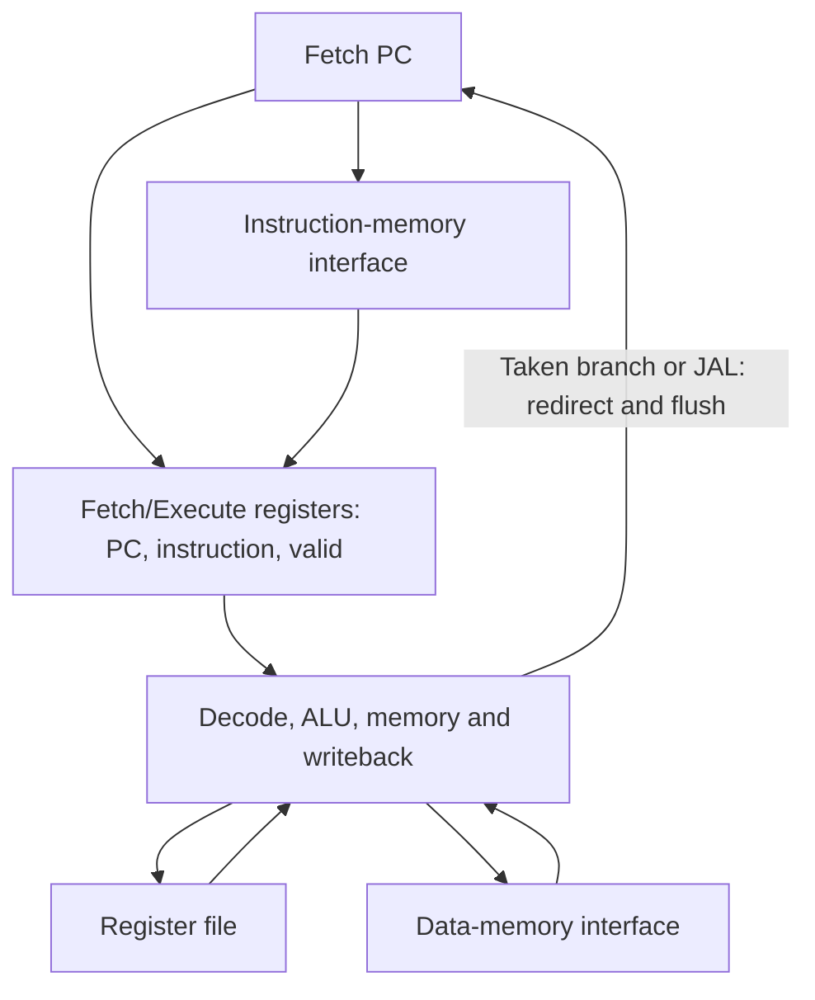
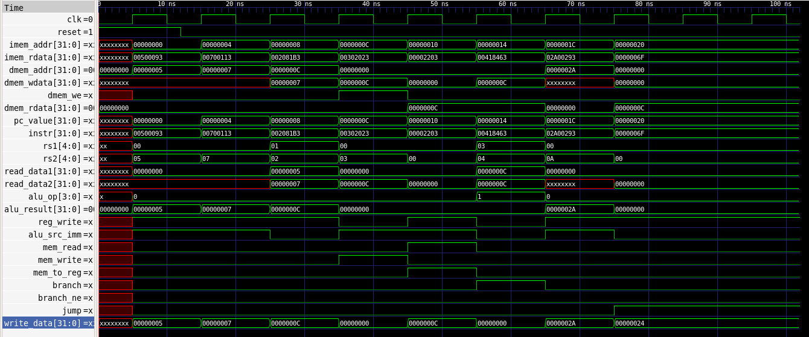
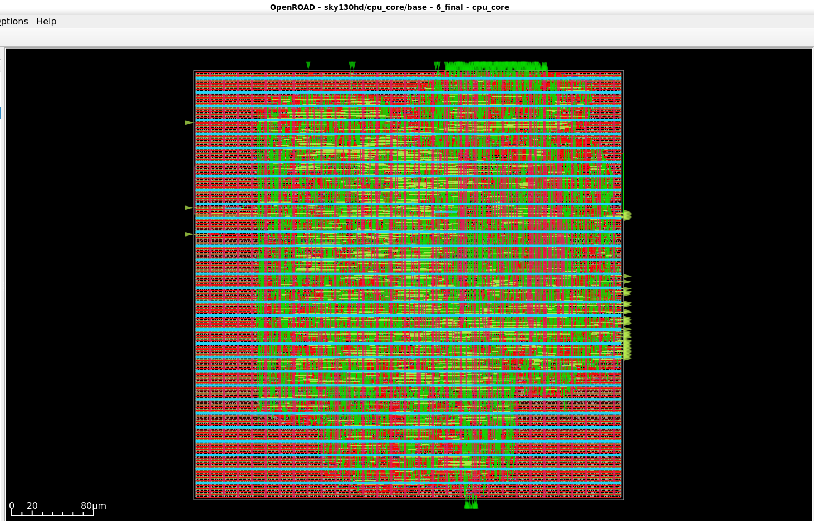
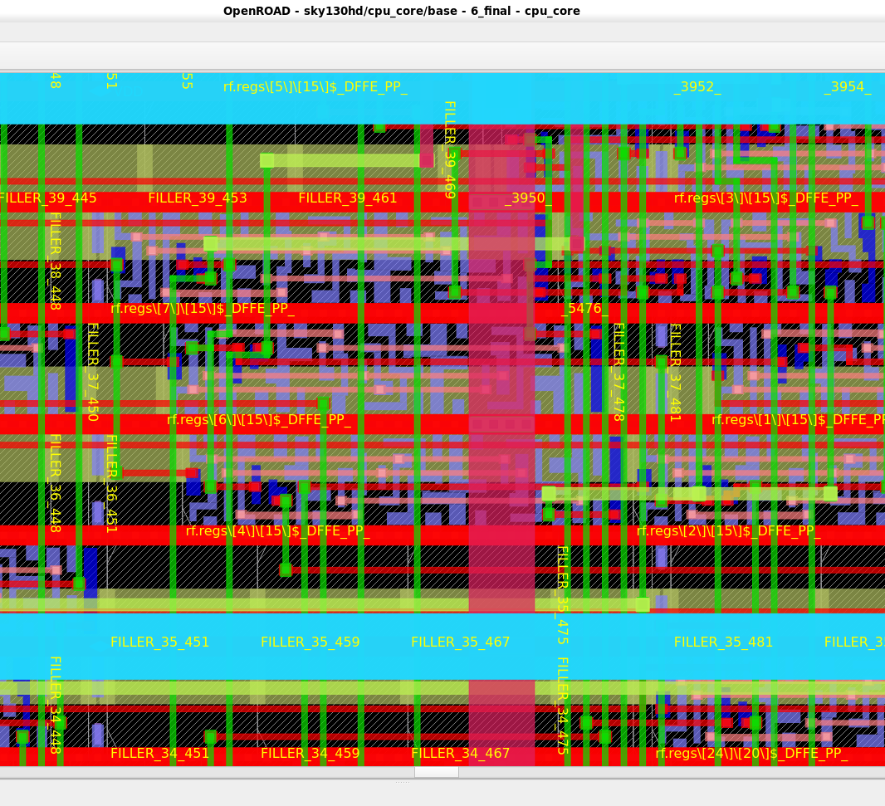

# TinyRV32

A compact SystemVerilog processor implementing an RV32I subset, with a
two-stage Fetch/Execute pipeline and an OpenROAD/SKY130 RTL-to-GDSII flow.

The project compares architectural changes through functional verification,
post-route timing analysis and measured instruction-cycle counts.

## Main Results

- Functional verification includes RTL unit tests, integrated CPU regression,
  wrong-path flush checks and 100 randomized differential programs.
- The pipeline achieved timing closure at the highest tested passing target
  of **113 MHz**, with **+0.15 ns worst setup slack**.
- The 114 MHz and 115 MHz implementations failed setup timing.
- All six pipeline implementations reported zero routing DRC violations.
- At 100 MHz, the pipeline reduced physical design area by **3.62%**
  relative to the measured single-cycle baseline.
- At the selected operating points of 100 MHz and 113 MHz, the pipeline
  reduced execution time by approximately **11.2–11.3%** on workloads
  without control-flow redirects.
- Taken-branch and JAL workloads took approximately **32% more time** because
  each redirect introduces a pipeline bubble.

## Architecture

The current core has two stages:

1. **Fetch:** present the fetch PC to the instruction-memory interface.
2. **Execute:** decode the registered instruction, read operands, execute,
   access data memory and write back the result.

The Fetch/Execute boundary holds the instruction, its PC and a valid bit.



Taken BEQ/BNE instructions and JAL redirect fetch and invalidate the
sequentially fetched instruction. Each redirect introduces one bubble.
Invalid execute entries cannot write registers or data memory.

The core uses separate instruction and data interfaces. The verification
environment provides combinational memory reads and synchronous stores,
without wait states.

### Implemented Instructions

| Category | Instructions |
|---|---|
| Arithmetic | ADD, SUB, ADDI |
| Logic | AND, OR, XOR |
| Shifts and comparison | SLL, SRL, SLT |
| Memory | LW, SW |
| Control flow | BEQ, BNE, JAL |

TinyRV32 implements this subset rather than the complete RV32I ISA.

### RTL Modules

| Module | Purpose |
|---|---|
| `cpu_core.sv` | Pipeline state, datapath integration and side-effect gating |
| `control_unit.sv` | Instruction decoding and control signals |
| `regfile.sv` | Integer register storage and operand reads |
| `alu.sv` | Arithmetic, logic, shifts and comparison |
| `imm_gen.sv` | Immediate extraction |
| `next_pc.sv` | Sequential and redirected PC selection |
| `pc.sv` | Program-counter module used by the single-cycle implementation |

## Functional Verification

Verification uses Icarus Verilog and an independent Python reference model.

The completed checks include:

- RTL unit tests;
- integrated CPU regression and reset checks;
- taken-branch wrong-path flush verification;
- independent reference-model checks;
- 100 randomized differential programs;
- PC, register and data-memory architectural-state comparison;
- six performance workloads with expected state and instruction-count checks.

From the current pipeline checkout:

```bash
make test
```

The performance harness additionally compares all integer registers and
data-memory words between the single-cycle and pipeline RTL snapshots.

## Physical Implementation

The implementation flow uses Yosys, OpenROAD Flow Scripts, OpenSTA and the
SKY130 HD standard-cell library.

RTL synthesis is followed by floorplanning, placement, clock-tree synthesis,
routing, static timing analysis and final GDSII generation.

### Architecture Comparison

These operating points use a 10 ns or 8.8496 ns clock period with 2 ns input
and output delays.

| Metric | Single-cycle, 100 MHz | Pipeline, 100 MHz | Pipeline, 113 MHz |
|---|---:|---:|---:|
| Clock period | 10 ns | 10 ns | 8.8496 ns |
| Reported worst setup-path arrival | 7.92 ns | 7.79 ns | 6.70 ns |
| Worst setup slack | +0.08 ns | +0.21 ns | +0.15 ns |
| Physical design area | 75,831 µm² | 73,084 µm² | 76,126 µm² |
| Utilization | 44% | 41% | 43% |
| Routing DRC violations | 0 | 0 | 0 |
| Final GDSII | Generated | Generated | Generated |

At 100 MHz, the pipeline improved setup margin by 0.13 ns and reduced
physical design area by 3.62%.

### Pipeline Frequency Sweep

Input and output delays were held at **2 ns** throughout this sweep.

| Target | Clock period | Worst setup slack | Setup TNS | Design area | Utilization | Routing DRC | Setup result |
|---|---:|---:|---:|---:|---:|---:|---|
| 100 MHz | 10.0000 ns | +0.21 ns | 0 ns | 73,084 µm² | 41% | 0 | PASS |
| 105 MHz | 9.5238 ns | +0.10 ns | 0 ns | 74,126 µm² | 41% | 0 | PASS |
| 110 MHz | 9.0909 ns | +0.07 ns | 0 ns | 74,783 µm² | 42% | 0 | PASS |
| **113 MHz** | **8.8496 ns** | **+0.15 ns** | **0 ns** | **76,126 µm²** | **43%** | **0** | **PASS** |
| 114 MHz | 8.7719 ns | −0.06 ns | −0.06 ns | 76,487 µm² | 43% | 0 | FAIL |
| 115 MHz | 8.6957 ns | −0.06 ns | −0.08 ns | 76,856 µm² | 43% | 0 | FAIL |

Each target produced a separate placement and routing solution, so timing
margin is not monotonic across targets.

**113 MHz is the highest tested timing-closed target.** This sweep does not
establish an exact maximum operating frequency.

Routing DRC counts come from the OpenROAD routing reports.

### Critical-Path Change

The measured single-cycle baseline had a direct path from
`imem_rdata[19]` to `dmem_addr[31]`, through operand selection,
register-file reads and address-generation logic.

The pipeline boundary removed that direct instruction-input-to-data-address
path. At 113 MHz, the reported worst setup path starts at a mapped flip-flop
and ends at `dmem_addr[20]`.

A dedicated LSU address-adder experiment was also evaluated before
pipelining. It retained the direct instruction-input-to-data-address path.

### Historical Single-Cycle Sweep

An earlier implementation sweep achieved timing closure at 98 MHz and
reported a −0.038 ns setup slack at 100 MHz. Its results are retained in
[the historical frequency-sweep report](physical/reports/frequency_sweep.md).

The later single-cycle baseline used in the comparison above passed at
100 MHz with +0.08 ns setup slack. These are separate implementation runs.

The following images document the earlier single-cycle implementation:







## Measured Workload Performance

Both RTL implementations execute identical programs.

Cycles include pipeline fill and end on the signature-store commit.
Reset cycles and the terminal JAL are excluded.

RTL simulation uses a 10 ns testbench clock. Execution times are calculated
from measured cycles at **100 MHz for single-cycle** and **113 MHz for
pipeline**; they are not simulator wall-clock times.

| Workload | Retired | Redirects | Single cycles | Pipeline cycles | Pipeline CPI | Single time, µs | Pipeline time, µs | Speedup |
|---|---:|---:|---:|---:|---:|---:|---:|---:|
| alu_dependency_chain | 515 | 0 | 515 | 516 | 1.0019 | 5.1500 | 4.5664 | 1.1278 |
| memory_dependency_chain | 386 | 0 | 386 | 387 | 1.0026 | 3.8600 | 3.4248 | 1.1271 |
| branch_not_taken | 259 | 0 | 259 | 260 | 1.0039 | 2.5900 | 2.3009 | 1.1257 |
| taken_branch_loop | 259 | 127 | 259 | 387 | 1.4942 | 2.5900 | 3.4248 | 0.7563 |
| jal_flush_chain | 258 | 128 | 258 | 387 | 1.5000 | 2.5800 | 3.4248 | 0.7533 |
| mixed_loop | 900 | 128 | 900 | 1029 | 1.1433 | 9.0000 | 9.1062 | 0.9883 |

Speedup is single-cycle execution time divided by pipeline execution time.
Values above 1 indicate a faster pipeline result.

All runs passed closed-form state/count oracles and full architectural-state
comparison between the two RTL snapshots.

For these workloads, with `N` retired instructions and `R` redirects:

```text
Single-cycle cycles = N
Pipeline cycles     = N + R + 1
```

The extra cycle is pipeline fill. Each redirect adds one bubble.

At the selected clock frequencies, the pipeline is faster when
`(R + 1) / N < 0.13`. The mixed workload exceeds this threshold and takes
approximately 1.18% more time.

The single-cycle 100 MHz target is a tested operating point, not its
measured maximum frequency.

## Reproducing the Measurements

### Functional and Performance Tests

Required tools: Git, Python 3, Icarus Verilog and Make.

```bash
make test

python3 verification/run_performance.py \
  --baseline 6ec637b \
  --single-mhz 100 \
  --pipeline-mhz 113
```

The performance runner extracts the baseline RTL from Git and snapshots the
current pipeline RTL without switching branches.

Measured source identifiers:

- Single-cycle RTL commit:
  `6ec637b161d326051904ab9ade76cc9e1d15b459`
- Pipeline snapshot HEAD:
  `7adbbe89e1d305c76d00afaf7a129d0430c45b28`

The manifest records actual RTL file hashes, snapshot metadata,
simulation-tool versions and benchmark settings.

Committed benchmark outputs:

- [Measured results](verification/performance/results/results.md)
- [CSV results](verification/performance/results/results.csv)
- [Source and tool manifest](verification/performance/results/manifest.json)
- [Benchmark methodology](verification/PERFORMANCE_BENCHMARK.md)

New runs write outputs under `build/performance/`.

### Physical Flow

Physical runs require Docker and a local OpenROAD Flow Scripts checkout.

```bash
ORFS_DIR="$HOME/OpenROAD-flow-scripts" \
  bash physical/scripts/run_two_stage_113mhz.sh
```

Equivalent scripts and experiment directories exist for 100, 105, 110,
114 and 115 MHz.

Constraints and saved reports are under
`physical/experiments/two_stage_pipeline_*mhz/`.

The baseline and pipeline runners export RTL from fixed Git commits,
verified against the benchmark manifest. They also export `config.mk`
and each experiment's SDC from a fixed configuration commit.

The runners check the pinned ORFS revision and tracked modifications,
and use a Docker image identified by its digest.

Input revisions and hashes are recorded in
[physical source pins](reproducibility/physical_sources.json).
The environment inspected after the sweep is recorded in
[physical environment](reproducibility/physical_environment.json).

The historical LSU-adder RTL snapshot has not been recovered.
Its runner is disabled until that source is available; the saved
historical reports are retained.

## Engineering Conclusions

The pipeline boundary improved the instruction-to-address timing structure,
but higher clock frequency did not produce a uniform workload speedup.

The measured trade-off depends on redirect frequency: straight-line code
benefits from the selected 113 MHz operating point, while frequent taken
branches and JAL instructions incur enough bubbles to outweigh that benefit.

The project demonstrates RTL design, automated verification, physical
implementation and quantitative architectural comparison.

## Further Work

- Reduce redirect penalties and measure the area/timing cost.
- Extend the supported instruction subset.
- Evaluate register-file and memory implementation alternatives.
- Recover the original RTL snapshot for the historical LSU experiment.
